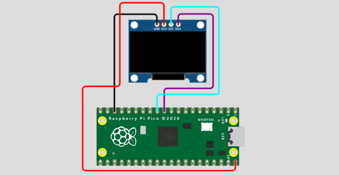
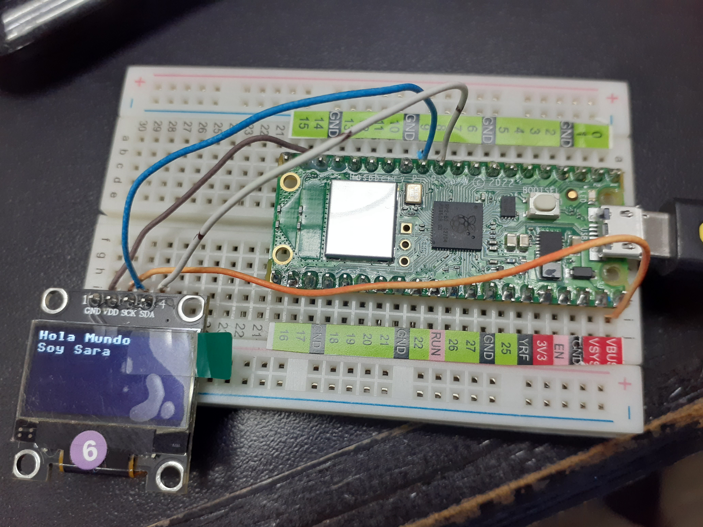
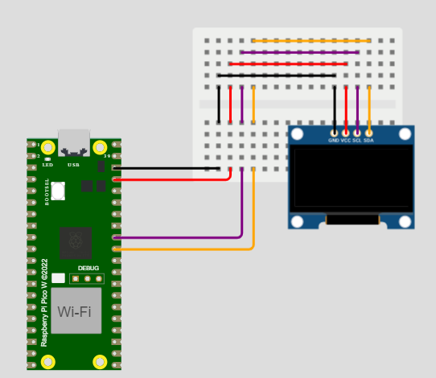
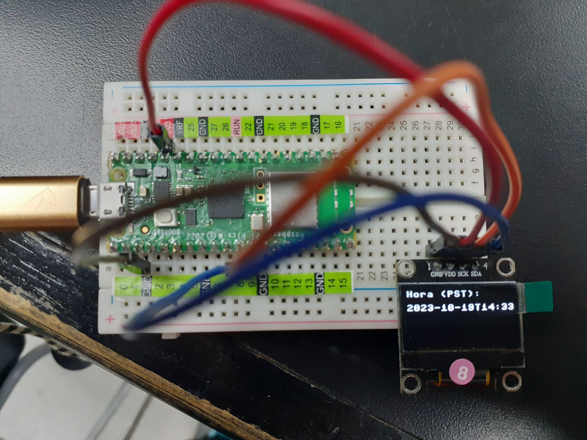
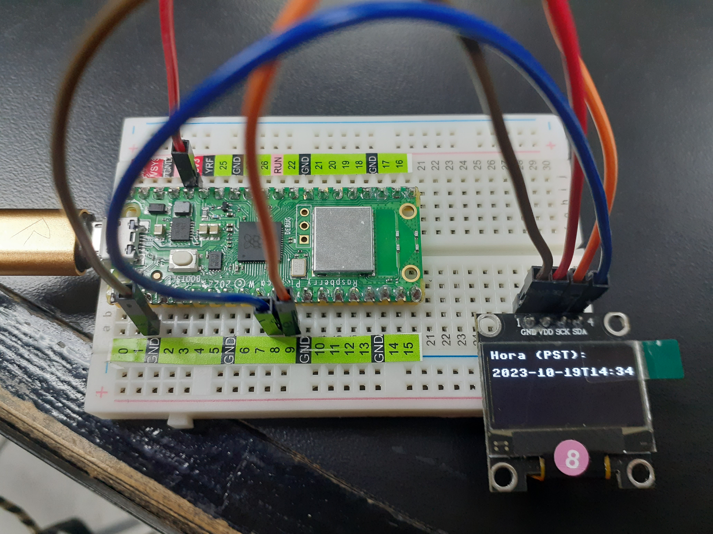

# RasberryPicoW

## Departamento de Sistemas y Computación
## Ing. En Sistemas Computacionales
## Sistemas Programables 23a

### Autor (es): Hernández Sáenz Sara Jazmín
### Fecha de revisión: 05/Octubre/2023

**_Objetivo_**
Aprender más de la Rasberry Pico w


## Practica de Prender el LED de la Pico W

### CÓDIGO
```python
## Autor: Hernandez Saenz  Sara Jazmín
## Fecha de revisión:   05/Oct/2023

from machine import Pin
from utime import sleep

led = machine.Pin("LED", machine.Pin.OUT)

while True:

    led.toggle()
    sleep(0.5)
##
```

### Evidencia de la práctica realizada

Apagado


Prendido


## Practica de Mostrar "Hola mundo" en el OLED y Pico W

### CÓDIGO
```python
## Autor: Hernandez Saenz  Sara Jazmín
## Fecha de revisión:   09/Oct/2023

import machine
import ssd1306

# Configura los pines SDA y SCL para la comunicación I2C
i2c = machine.I2C(0, sda=machine.Pin(8), scl=machine.Pin(9))

# Configura el objeto SSD1306 para la pantalla OLED
oled = ssd1306.SSD1306_I2C(128, 64, i2c)

# Limpia la pantalla
oled.fill(0)
oled.show()

# Dibuja "Hola Mundo" en la pantalla
oled.text("Hola Mundo", 0, 0)
oled.text("Soy Sara", 0, 10)

# Actualiza la pantalla para mostrar el texto
oled.show()
##
```

### Evidencia de la práctica realizada

Circuito



Corriendo en el OLED




## Practica de desplegar en el OLED y Pico W por medio de internet

### CÓDIGO
```python
## Autor: Hernandez Saenz  Sara Jazmín
## Fecha de revisión:   18/Oct/2023

#librerias y módulos
import network
import urequests
import utime
from machine import Pin, I2C
import ssd1306

#definición de funciones

#función para la conexión a Wi-Fi
def conexion(ssid, contra):
 #verificación de conexión
 sta_if = network.WLAN(network.STA_IF)
 #condición para reconocer la conexión
 if not sta_if.isconnected():
     print("¡Espere! Conectando a Wi-Fi ")
     sta_if.active(True)
     sta_if.connect(ssid, contra)
     
 while not sta_if.isconnected():
     pass
     print("¡Conexión con éxito!")
     print('IP:', sta_if.ifconfig()[0]) #despliegue de la dirección ip asignada

#función para la obtención de la hora actual
def hr_internet():
#servicio web que brinda la hora actual
    url = "http://worldtimeapi.org/api/ip" 
    response = urequests.get(url)
    dat = response.json()
    return dat['datetime'] #devuelve el valor

#función de configuración de pines para la conexión y comunicación del oled
def config_pantalla(): 
    i2c = I2C(0, sda=Pin(8), scl=Pin(9)) 
    oled = ssd1306.SSD1306_I2C(128, 64, i2c)
    return oled

#función para el despliegue de resultados en pantalla
def despliegue_oled(oled, hr):
    oled.fill(0) #propiedades de despliegue
    oled.text("Hora (PST):", 0, 0) #mensaje
    oled.text(hr, 0, 16)
    oled.show()

#definición de red a la que se hará la conexión
ssid = "OPPO A53"
contra = "f082dd9d35a2"
#llamada a la función y envío de parametros
conexion(ssid, contra) 
oled = config_pantalla()

#blucle para imprimir en la pantalla y consola los resultados
while True:
    hr = hr_internet()
    print("Hora actual:", hr)
    despliegue_oled(oled, hr)
    utime.sleep(60)
##
```

### Evidencia de la práctica realizada

Circuito



Corriendo en el OLED




