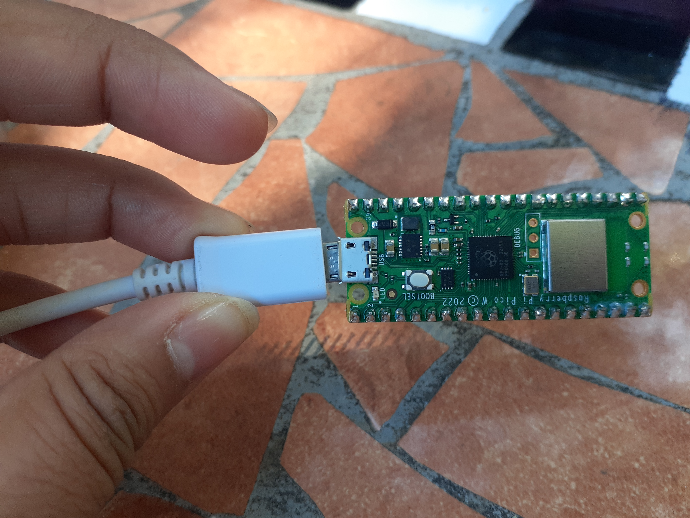
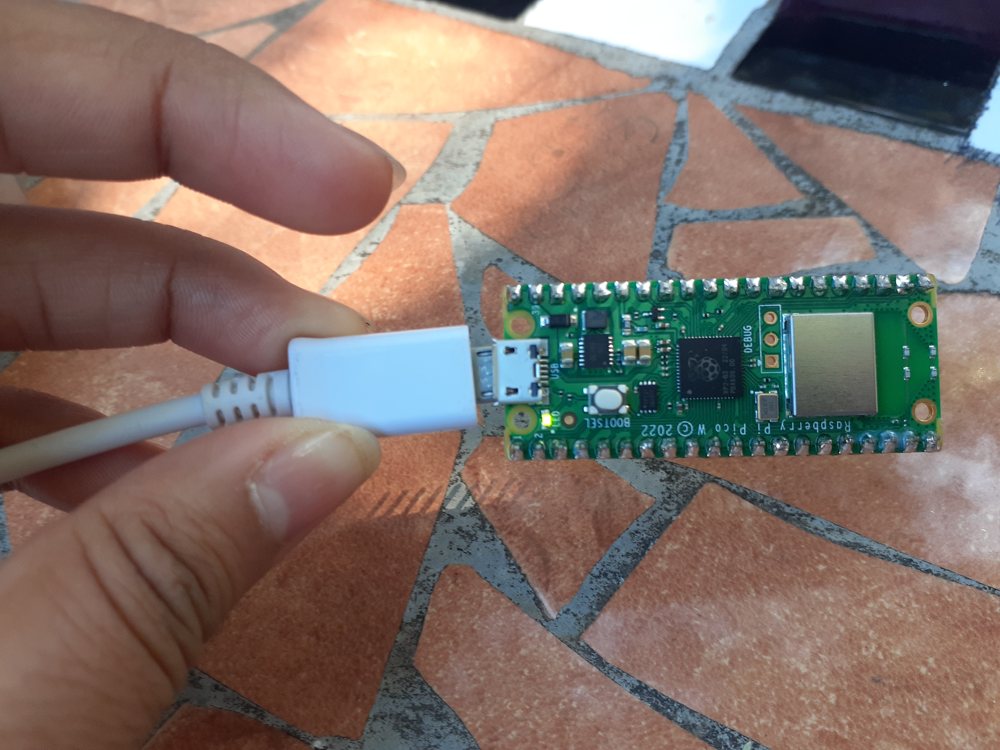

# RasberryPicoW

## Departamento de Sistemas y Computación
## Ing. En Sistemas Computacionales
## Sistemas Programables 23a

### Autor (es): Hernández Sáenz Sara Jazmín
### Fecha de revisión: 05/Octubre/2023

**_Objetivo_**
Aprender más de la Rasberry Pico w


## Practica de Prender el LED de la Pico W

### CÓDIGO
```python
## Autor: Hernandez Saenz  Sara Jazmín
## Fecha de revisión:   05/Oct/2023

from machine import Pin
from utime import sleep

led = machine.Pin("LED", machine.Pin.OUT)

while True:

    led.toggle()
    sleep(0.5)
##
```

### Evidencia de la práctica realizada

Apagado



Prendido




## Practica de Mostrar "Hola mundo" en el OLED y Pico W

### CÓDIGO
```python
## Autor: Hernandez Saenz  Sara Jazmín
## Fecha de revisión:   09/Oct/2023

import machine
import ssd1306

# Configura los pines SDA y SCL para la comunicación I2C
i2c = machine.I2C(0, sda=machine.Pin(8), scl=machine.Pin(9))

# Configura el objeto SSD1306 para la pantalla OLED
oled = ssd1306.SSD1306_I2C(128, 64, i2c)

# Limpia la pantalla
oled.fill(0)
oled.show()

# Dibuja "Hola Mundo" en la pantalla
oled.text("Hola Mundo", 0, 0)
oled.text("Soy Sara", 0, 10)

# Actualiza la pantalla para mostrar el texto
oled.show()
##
```

### Evidencia de la práctica realizada

Circuito


Corriendo en el OLED


