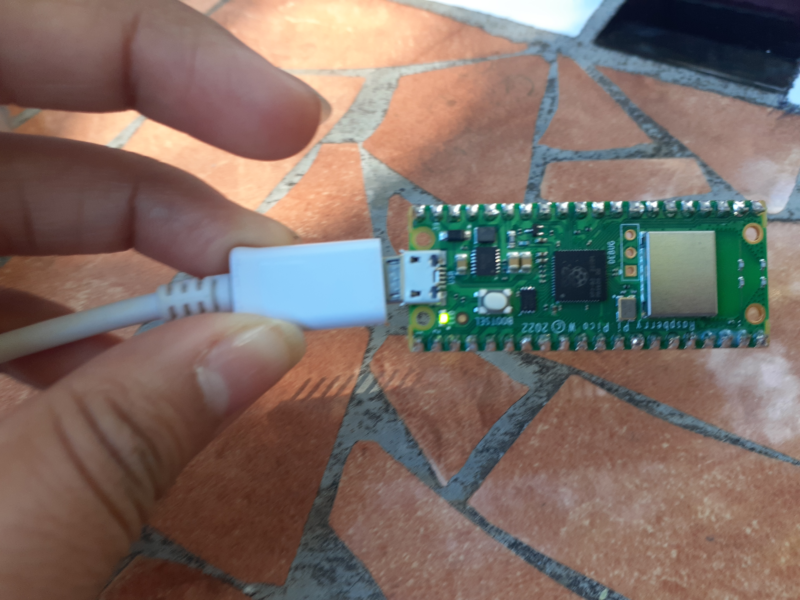

# RasberryPicoW

# Departamento de Sistemas y Computación
# Ing. En Sistemas Computacionales
# Sistemas Programables 23a

## Autor (es): Hernández Sáenz Sara Jazmín
## Fecha de revisión: 05/Octubre/2023

**_Objetivo_**
Aprender más de la Rasberry Pico w


## Practica de Prender el LED de la Pico W

# CÓDIGO
```python
## Autor: Hernandez Saenz  Sara Jazmín
## Fecha de revisión:   05/Oct/2023

from machine import Pin
from utime import sleep

led = machine.Pin("LED", machine.Pin.OUT)

while True:

    led.toggle()
    sleep(0.5)
##
```





